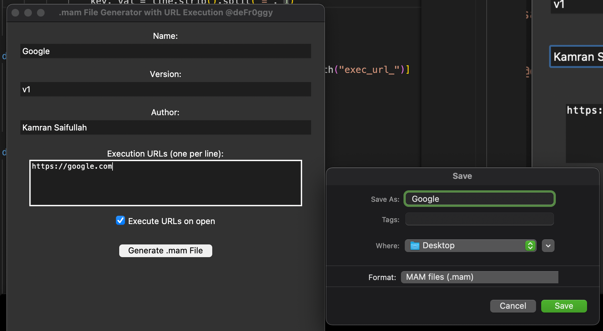
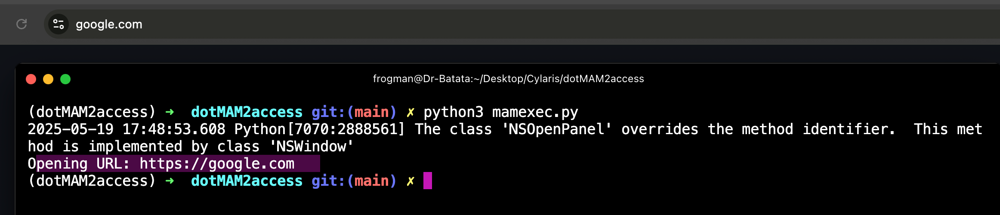

# dotMAM2access

Python implementation of .MAM file generation for Remote File Inclusions (MS Access Macro) &amp; Execution.

- https://posts.specterops.io/phishing-tales-microsoft-access-macro-mam-shortcuts-c0bc3f90ed62

It has been observed that threat actors have used this technique as early as > 5 months in their phishing campaigns targeting wide variety of customers.

## Gist

The basic idea behind this tool was to automate the generation of .MAM file to link it with the file that is required to be executed and/or open the domains. 

In this implementation, the `memexec.py` simply opens the domain that is listed under `.MAM` file. 

However, when it comes to the actual implementation, the `.MAM` files are shortcuts or you can say acts as a pointer to a remotely hosted `.ACCDE` file i.e. Microsoft Access Database containing the `VBA Macros`.

Threat actors can have this file sent over email to the victims while pointing the `.ACCDE` file hosted over HTTP/SMB. The shortcut calls the file and have it executed. 

Definitely if the `Macros` are disbaled it might not run and gives a prompt to execute the macros. But this might not happen in the older version of MS Access/Office etc. 

## mamgen.py

The script is responsible to generating the `.MAM` file. Rather than creating is manually, it can be achived via GUI. 

## .MAM Executor

The script is responsible for executing the `.MAM` file. This is a custom implementation. In case of real victim, this is not required and `.MAM` file will work automatically.

In our case `mamexec.py` will read the `.MAM` file as we have to point to script to it, finds out the domains and then simply opens the default web browser to open the URL/Domain embedded within the `.MAM` file. 

## Thoughts

Its a pretty cool method from the past. But we don't really have to forget that some really good custom implementations of this tool can come into the market. As more complex the environment is becoming, the more simple the attack might become that can lead to a successful compromise. 

`I will also recommend to go through the first post as it shows how this thing actually works. The tool in this repo is not exactly how it should work but a different implementation of the same.`